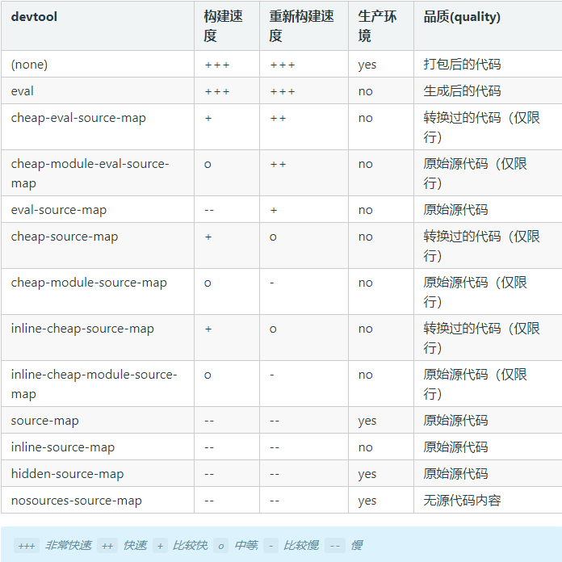

## source map

由于`webpack`最终会将js打包压缩为一个文件，如果其中的一个文件报错，那么将很难追踪报错的文件位置，这时候`webpack`提供了`source map`功能。

添加如下代码：
```javascript
devtool:'inline-source-map'
```
`devtool`中还有很多其他的配置，由于`source map`每个模块相互分离，并用模块名进行注释，所以可以看到编译前的代码。所以打包速度会很慢。具体配置如下图：

[图片来源](https://www.webpackjs.com/configuration/devtool/)

## webpack-dev-server

`webpack-dev-server`可以提供简单的web服务器，实现实时重新加载。
首先安装插件，配置`webpack.config.js`,添加代码：
```javascript
devServer:{
  contentBase:'./dist'
}
```
添加`script`命令
```javascript
"scripts": {
  "test": "echo \"Error: no test specified\" && exit 1",
  "build": "webpack",
  "watch": "webpack --watch",

  //添加启动服务器命令
  "start":"webpack-dev-server --open"
},
```
终端运行`npm run start`启动服务器，修改js文件可以看到页面的变化。